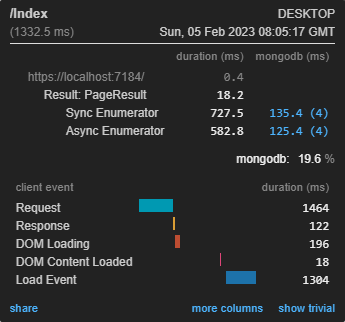
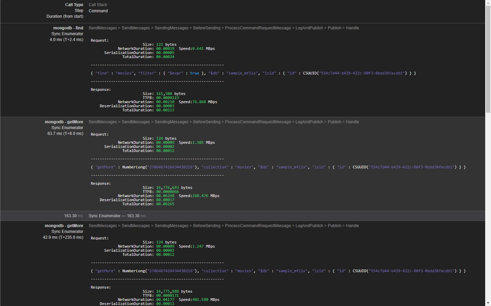

<br/>
<p align="center">
  <a href="https://github.com/ShaanCoding/ReadME-Generator">
    
  </a>
  <h3 align="center">Mini Query Profiler for MongoDB</h3>

  <p align="center">
    Know what queries are been executed and what needs investigation and improvements in our MongoDB application.
    <br/>
    <br/>
  </p>
</p>

## Table Of Contents

* [About the Project](#about-the-project)
* [Built With](#built-with)
* [Getting Started](#getting-started)
  * [Prerequisites](#prerequisites)
  * [Installation](#installation)
* [Usage](#usage)
* [License](#license)
* [Authors](#authors)
* [Acknowledgements](#acknowledgements)

## About The Project




Miniprofiler is an OpenSource started by StackExchange, that makes it extremely easy to understand and profile your .NET and ASP.NET applications. And offer inbox profiling for EF and ADO.NET, but not for MongoDB.

This project adds a new custom Profier category to Miniprofiler for MongoDB

Goals:

* Easy identity bottlenecks.
* Profile the response timing of your MongoDB.
* Understood better the Mongo query generated by the Driver or LINQ.
* See the generated query quicker and easier. 

## Built With

- C#, .NET 7
- and Love.

## Getting Started

Install, and set up your MongoClient with `MiniProfilerMongoDbEventSubscriber` and follow Miniprofiiler documentation to know how to use Miniprofiiler. Or follow our _samples_.

### Prerequisites

* Your project needs to be compatible with [_.NET Standard 2.1_](https://learn.microsoft.com/en-us/dotnet/standard/net-standard?tabs=net-standard-2-1)
* [Miniprofiller](https://github.com/MiniProfiler/dotnet)
* [MongoDB Driver](https://github.com/mongodb/mongo-csharp-driver)
* [MiniProfiler.MongoDB - _this project_](#installation)

Register `MiniProfilerMongoDbEventSubscriber` in your `MongoClient` instance.

```csharp
const string connectionString = "mongodb://localhost:27017/?readPreference=primary&ssl=false&directConnection=true";

var mongoClientSettings = MongoClientSettings.FromUrl(new MongoUrl(connectionString));
mongoClientSettings.ClusterConfigurator = cb =>
{
    cb.Subscribe(new MiniProfilerMongoDbEventSubscriber()); // Hook MongoDriver Events to add MiniProfiler custom profiling data.
};
var dbClient = new MongoClient(mongoClientSettings);
```

### Installation

1. Install the `MiniProfiler.MongoDB` package (**COMMING SOON**)

## Usage

Use this space to show useful examples of how a project can be used. Additional screenshots, code examples and demos work well in this space. You may also link to more resources.

_For more examples, please refer to the [Documentation](https://example.com)_


## License

Distributed under the MIT License. See [LICENSE](https://github.com/rafaelsc/MiniProfiler.MongoDB/blob/main/LICENSE.md) for more information.

## Authors

* **Rafael Silveira Cordeiro** - *FullStack Software Engineer with 25+ years of experience in software development.* - [Rafael Silveira Cordeiro](https://github.com/rafaelsc/) - *Code, Samples, Documentation*

## Acknowledgements

* [Miniprofiler](https://miniprofiler.com/dotnet/)
* [MongoDB C# Drivers](https://github.com/mongodb/mongo-csharp-driver)
* [StackExchange](https://stackexchange.com/about)
